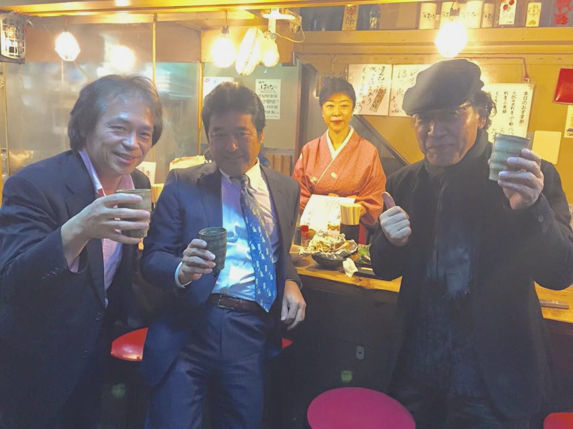

# hannari
<!-- saved from url=(0054)https://naoyu.net/sample/scroll-background-fadein.html -->
<html lang="ja">
	<head>
		<meta http-equiv="Content-Type" content="text/html; charset=UTF-8">
<title>Scroll Background Fadein | naoyu.net</title>
<meta name="viewport" content="width=device-width, initial-scale=1.0, user-scalable=no">
<!-- Global site tag (gtag.js) - Google Analytics -->

<link rel="preload" href="./Scroll Background Fadein _ naoyu.net_files/f.txt" as="script"><link rel="preload" href="./Scroll Background Fadein _ naoyu.net_files/f(1).txt" as="script"><link rel="preload" href="https://pagead2.googlesyndication.com/pagead/js/r20190417/r20190131/show_ads_impl.js" as="script"></head>
<body>

<section id="contents">
    

        

        

            

            <h1><marquee behavior="alternate">!!! 吉祥寺 雪路 はんなりの会 2013?~2019年の記録 !!!</marquee></h1>
            
            
            
            
            
            
            
            
            
            
            
            
            
            
            
            
            
            
          

        

    
<!-- content01 -->
    

        

        

            

            <h1><marquee behavior="alternate">!!! 池袋 有志 同期会 2010/08/28 !!!</marquee></h1>
            
            
            
            
            
            
            
            
            
            

        

    
<!-- content02 -->
    

        

        

        

    
<!-- content03 -->
</section>

<ins class="adsbygoogle adsbygoogle-noablate" data-adsbygoogle-status="done" style="display: none !important;"><ins id="aswift_0_expand" style="display:inline-table;border:none;height:0px;margin:0;padding:0;position:relative;visibility:visible;width:0px;background-color:transparent;"><ins id="aswift_0_anchor" style="display:block;border:none;height:0px;margin:0;padding:0;position:relative;visibility:visible;width:0px;background-color:transparent;"><iframe frameborder="0" marginwidth="0" marginheight="0" vspace="0" hspace="0" allowtransparency="true" scrolling="no" allowfullscreen="true" onload="var i=this.id,s=window.google_iframe_oncopy,H=s&amp;&amp;s.handlers,h=H&amp;&amp;H[i],w=this.contentWindow,d;try{d=w.document}catch(e){}if(h&amp;&amp;d&amp;&amp;(!d.body||!d.body.firstChild)){if(h.call){setTimeout(h,0)}else if(h.match){try{h=s.upd(h,i)}catch(e){}w.location.replace(h)}}" id="aswift_0" name="aswift_0" style="left:0;position:absolute;top:0;border:0px;width:0px;height:0px;" src="./Scroll Background Fadein _ naoyu.net_files/saved_resource(2).html"></iframe></ins></ins></ins><iframe id="google_osd_static_frame_3962800001390" name="google_osd_static_frame" style="display: none; width: 0px; height: 0px;" src="./Scroll Background Fadein _ naoyu.net_files/saved_resource(3).html"></iframe></body><iframe id="google_shimpl" style="display: none;" src="./Scroll Background Fadein _ naoyu.net_files/saved_resource(4).html"></iframe><iframe id="google_esf" name="google_esf" src="./Scroll Background Fadein _ naoyu.net_files/zrt_lookup.html" data-ad-client="ca-pub-7408088410773034" style="display: none;"></iframe>
<!-- フッタ -->
 <footer>
 Copyright 2019/04/19 Pe-Young(S.Hada)
 </footer>
